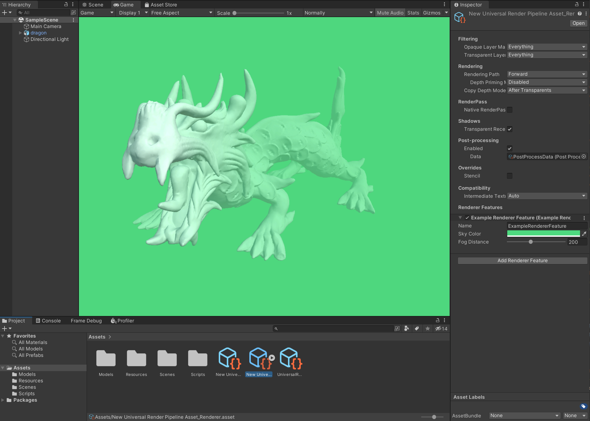

# Unity SRP Compute Shader Render Feature Example (2022.1.10f1)
This repo shows usage of a compute shader in a render feature pass instead of the traditional full-screen fragment shader approach.

The effect is a simplified depth fog, with controls to adjust the distance and colour of the fog.

